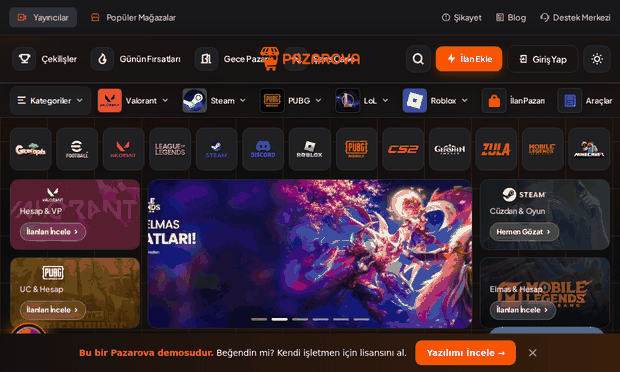

🌐 <a href="README.md">Türkçe</a> · <b>English</b>

  

# Pazarova — Multi-Vendor Marketplace Software & E-pin Script

**Multi-vendor marketplace script.** A commission-based **marketplace software** with **escrow** protection where users open their own store and post listings.

Game items · accounts · in-game currency · e-pin · digital goods — safe trading, PHP.

 

&nbsp;

  

 

> [!TIP]
> **▶ Live demo:** [pazarova.epinsoft.com.tr](https://pazarova.epinsoft.com.tr)
>
> **✉️ Purchase & licensing:** pazarlama@epinsoft.com.tr
>
> **📞 Phone:** +90 850 255 18 01

> This is a **showcase repository**. The source code is private; this repo only presents screenshots and highlights.

---

## 🎬 Live Preview

  

## 📸 Screenshots

| Home | Stores |
|---|---|
|  |  |

| Product | Wheel of Fortune 🎡 |
|---|---|
|  |  |

| Night Market 🌙 | Features |
|---|---|
|  |  |

  

### 📱 Mobile (responsive)

  
  &nbsp;
  
  &nbsp;
  

### 🛠️ Admin Panel & Integrations

| Supplier / API Integrations | Marketplace Settings (escrow/commission) |
|---|---|
|  |  |

| Sales Reports & Analytics | Gamification (Wheel/Night Market) |
|---|---|
|  |  |

> 🔌 **Integration layer:** API integrations for e-pin/stock suppliers, webhooks, payment gateway modules (connect your own POS).

---

## ⭐ Highlights
- 🏪 **Multi-vendor marketplace** — members open their own store and post listings
- 🔒 **Escrow** + delivery confirmation + dispute resolution
- 💬 **In-order messaging** — seen receipts, message editing, emoji reactions
- 📊 **Seller panel** — earnings, orders, stock, coupons, CRM tags
- 🚀 **Boost & featuring**, avatar frames, membership packages
- 🏅 **Seller tiers** (commission tiers, volume-based auto-upgrade)
- 🎡 **Gamification** — Wheel of Fortune & Night Market
- 🛡️ **Admin panel** — store curation, featured stores, reports
- 📱 **Mobile-friendly**, single brand color (orange `#FF5501`)

## 🧩 Tech
PHP (CodeIgniter 3 · HMVC) · MySQL/MariaDB · server-side rendering. Payment gateways are modular; you connect your own provider.

## 💼 Purchase / Contact
Pazarova is **for sale** (e-pin script / marketplace script). Explore the live demo and get in touch for purchase & licensing:

- ✉️ **Email:** pazarlama@epinsoft.com.tr
- 📞 **Phone:** +90 850 255 18 01

## 📄 License
Proprietary / commercial software — **All rights reserved**. See [LICENSE.txt](LICENSE.txt).

---

<b>Keywords:</b> e-pin script, epin software, multi-vendor marketplace script, escrow marketplace php, game items marketplace script, digital goods marketplace, in-game currency store, reseller marketplace, e-commerce PHP script.
