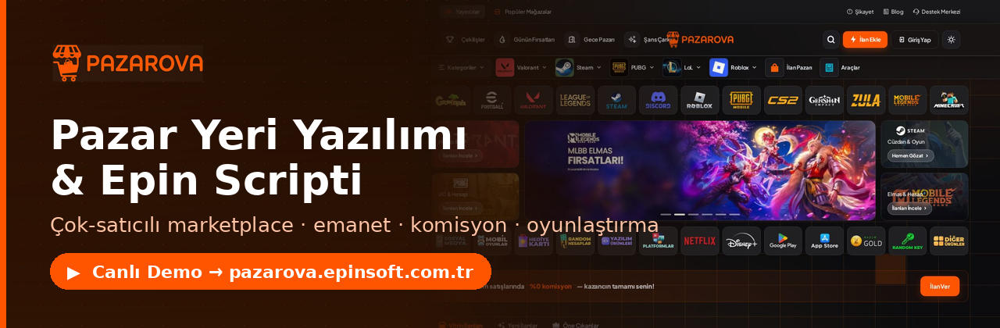
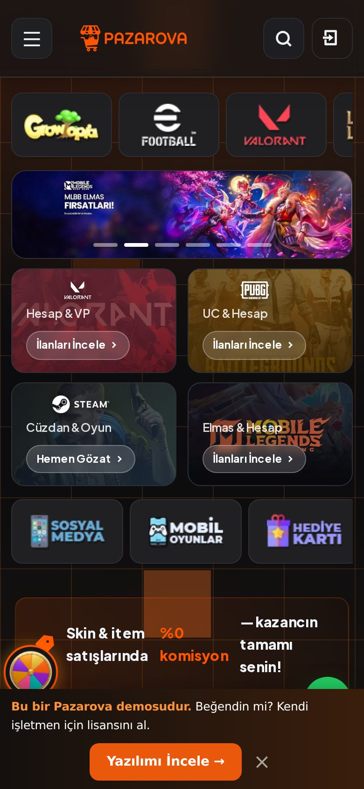
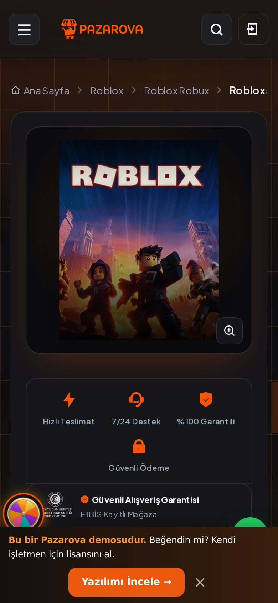
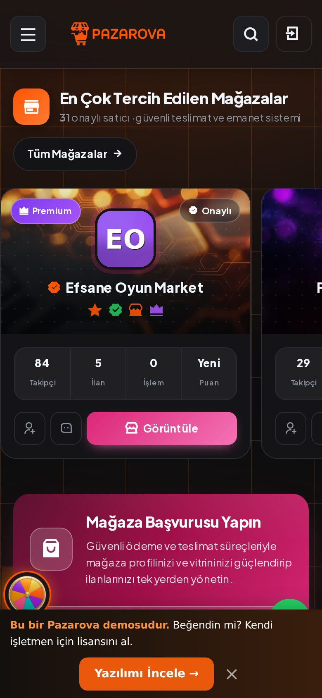

  

# Pazarova — Pazar Yeri Yazılımı & Epin Scripti

**Çok‑satıcılı marketplace scripti.** Kullanıcıların kendi mağazasını açıp ilan yayınladığı, **emanet (escrow)** korumalı, komisyonlu bir **pazar yeri yazılımı**.

Oyun eşyası · hesap · oyun parası · epin · dijital ürün — güvenli alışveriş, PHP.

**[▶ Canlı Demo](https://pazarova.epinsoft.com.tr)** · **[Ekran Görüntüleri](#-ekran-görüntüleri)** · **[İletişim](mailto:pazarlama@epinsoft.com.tr)**

 

&nbsp;

  

 

> [!TIP]
> **Canlı demoyu hemen incele →** [pazarova.epinsoft.com.tr](https://pazarova.epinsoft.com.tr)
> Satın alma & lisanslama: **pazarlama@epinsoft.com.tr** · **+90 850 255 18 01**

> Bu bir **tanıtım vitrinidir**. Kaynak kod ve teknik detaylar özeldir; bu depo yalnızca ekran görüntülerini ve öne çıkan özellikleri sergiler.

---

## 📸 Ekran Görüntüleri

| Ana Sayfa | Mağazalar |
|---|---|
|  |  |

| Ürün Detay | Şans Çarkı 🎡 |
|---|---|
|  |  |

| Gece Pazarı 🌙 | Özellikler |
|---|---|
|  |  |

  

### 📱 Mobil Görünüm (responsive)

  
  &nbsp;
  
  &nbsp;
  

### 🛠️ Yönetim Paneli & Entegrasyonlar

| Tedarikçi / API Entegrasyonları | Pazar Yeri Ayarları (emanet/komisyon) |
|---|---|
|  |  |

| Satış Raporları & Analiz | Oyunlaştırma (Şans Çarkı/Gece Pazarı) |
|---|---|
|  |  |

> 🔌 **Entegrasyon altyapısı:** e‑pin/stok tedarikçileri için API entegrasyonu (Hyper, GamePoint, OyunFor tipi API Key + Token), webhook, ödeme geçidi modülleri (alıcı kendi POS'unu bağlar).

---

## ⭐ Öne Çıkan Özellikler
- 🏪 **Çok‑satıcılı pazar yeri** — üyeler kendi mağazasını açar, ilan yayınlar
- 🔒 **Emanet (escrow)** + teslimat onayı + uyuşmazlık çözümü
- 💬 **Sipariş‑içi mesajlaşma** — görüldü bilgisi, mesaj düzenleme, emoji tepki
- 📊 **Satıcı paneli** — kazanç, sipariş, stok, kupon, CRM etiketleri
- 🚀 **Doping & öne çıkarma**, avatar çerçeveleri, üyelik paketleri
- 🏅 **Satıcı seviyeleri** (komisyon kademeleri, hacimle otomatik yükselme)
- 🎡 **Oyunlaştırma** — Şans Çarkı & Gece Pazarı
- 🛡️ **Yönetim paneli** — mağaza vitrin yönetimi, öne çıkan mağazalar, raporlar
- 📱 **Mobil uyumlu**, tek marka rengi (turuncu `#FF5501`)

## 🧩 Teknoloji
PHP (CodeIgniter 3 · HMVC) · MySQL/MariaDB · sunucu‑taraflı render.
Ödeme geçitleri modülerdir; alıcı kendi ödeme sağlayıcısını bağlar.

## 🔎 Kullanım Alanları
Pazarova'yı aşağıdaki işletmeler için hazır bir çözüm olarak geliştirdim:
- **Epin scripti / epin yazılımı** (e‑pin scripti) — epin satış sitesi, epin bayilik sistemi
- **Oyun eşyası pazar yeri scripti** — skin, item, hesap alım‑satımı (çok satıcılı)
- **Dijital ürün satış yazılımı** — oyun parası, oyun kodu, lisans, abonelik
- **Marketplace scripti** — komisyonlu, emanetli (escrow) çok‑satıcılı pazar yeri
- **Bayilik / reseller scripti** — satıcı seviyeleri ve komisyon kademeleri ile

## 💼 Satın Alma / İletişim
Pazarova'yı **satıyorum** (epin scripti / epin yazılımı / pazar yeri scripti). Canlı demoyu inceleyebilir, satın alma ve lisanslama için benimle iletişime geçebilirsiniz:

- ✉️ **E‑posta:** pazarlama@epinsoft.com.tr
- 📞 **Telefon:** +90 850 255 18 01

---

<b>Anahtar kelimeler:</b> epin scripti, epin yazılım, epin yazılımı, epin script, epin satış scripti, epin bayilik scripti, epin satış sitesi scripti, e‑pin scripti, e‑pin yazılımı, oyun eşyası satış scripti, oyun eşyası pazar yeri, dijital ürün satış yazılımı, çok satıcılı marketplace scripti, oyun parası satış sistemi, hesap satış scripti, PHP epin / e‑ticaret / pazar yeri yazılımı.

## 📄 Lisans
Özel/ticari yazılım — **Tüm hakları saklıdır**. Bkz. [LICENSE.txt](LICENSE.txt).
